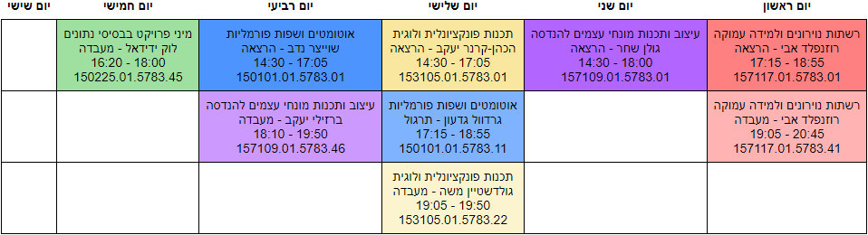
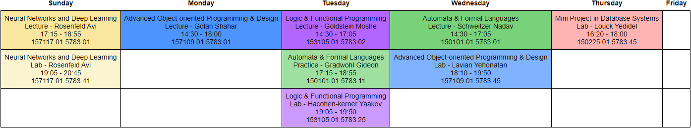

# Semester Organizer

The semester organizer is a tool for the students at Lev Institute to create a schedule quickly and efficiently.
The tool is implemented with the CSP algorithm.
With the semester organizer, you can create a time system according to your convenience.

### Save your time and effort, and get the best schedule suit for you!


## Table of Contents

- [Preview](#preview)
- [Features](#features)
- [Prerequisites](#prerequisites)
- [How to use](#how-to-use)
  - [WebUI (Web User Interface - One click) - NEW !](#webui-web-user-interface---one-click---new-)
  - [CLI (Command Line Interface)](#cli-command-line-interface)
- [How to update courses](#how-to-update-courses)
- [FAQ](#faq)
- [License](#license)
- [Feedback](#feedback)

## Preview

The semester organizer helps you create a personalized schedule quickly and efficiently. Below are some example outputs:






## Features

- If you consider the course, all the places are taken.
- If we consider only the courses that can be enrolled in for the server (username and password for the Levant site are required).
- Consider which days to study.
- Cross platform.
- Support both Hebrew and English.

#### Make your choices easy!

- Show all courses ordered only from those that can be enrolled in.
- Show all courses that can be taken after all prerequisite courses have been completed.
- View all active courses current semester
- Select your favorite lecturers
- Select courses from other degrees and create a dynamic schedule. (From example, if you are from Computer science and want to take courses in Software engineering)
- Config the settings however you want!

#### Easy to use!

- Just run python main.py and select your courses.

#### Several output formats !

- CSV
- Excel
- Image

## Prerequisites

- Python version 3.8 and above, Preferred version >= 3.13 for efficient and fast use.
- Chrome browser installed.
- Git bash or any terminal support your language (pycharm doesn't support Hebrew by default)

### Config git bash to support Hebrew

- Change the settings (right-click on the screen of git bash)
- Options -> Text -> Font -> Select font "Miriam Fixed"
- Options -> Text -> Character set: Change to utf-8

## WebUI (Web User Interface - One click) - NEW !
- Download the project, 3 options:
    1. via github download link: https://github.com/ItamarShalev/semester_organizer/archive/refs/heads/main.zip
    2. via git https clone:
        ```bash
        git clone https://github.com/ItamarShalev/semester_organizer.git
        ```
    3. via ssh git clone:
        ```bash
        git clone git@github.com:ItamarShalev/semester_organizer.git
        ```
- Run the web server by running the file `SemesterOrganizer.bat`

## CLI (Command Line Interface)

- Open terminal (Git bash recommended and must for Hebrew)
- Clone the project


via https: 
```bash
git clone https://github.com/ItamarShalev/semester_organizer.git
```

via ssh: 
```bash
git clone git@github.com:ItamarShalev/semester_organizer.git
```

- Change the directory to the project

```bash
cd semester_organizer
```
- Update pip version

```bash
python -m pip install --upgrade pip
```

- Install dependencies

```bash
python -m pip install -r requirements.txt
```

- Start the main console flow.

```bash
python main.py
```
If you want to change the language or start another flow, check the help.

```bash
python main.py -h
```

For example:

```bash
python main.py --flow console --language hebrew
```

The above line is the default and you can just run: 

```bash
python main.py
```

- To get the new data and code, you can reset your repo (your personal selection will be saved)
```bash
git fetch --all && git reset --hard origin/main
```

## How to update courses

Semester organizer works offline for efficient uses.

In order to update the courses information hours and etc
You should run the update script.

(Notice, the flags should be only on the first update)
```bash
python update_levnet_data.py --user <YOUR_LEVNET_USERNAME> --password <YOUR_LEVNET_PASSWORD>
```

Don't worry, the user information saved locally only.

## FAQ

#### I have issues with my data and don't get all, or some tables aren't there.

The project is in development, so some new features were added and changed the base.
You can clean your data and get the new one from the server.

```bash
git clean -fdx && git fetch --all && git reset --hard origin/main
```

## License

[Apache-2.0](LICENSE)


## Feedback

If you have any feedback, ideas, or any suggestion, please reach out via the email itamar.shalevv@gmail.com

Also, if you liked it, please give a star to the project (top right)
